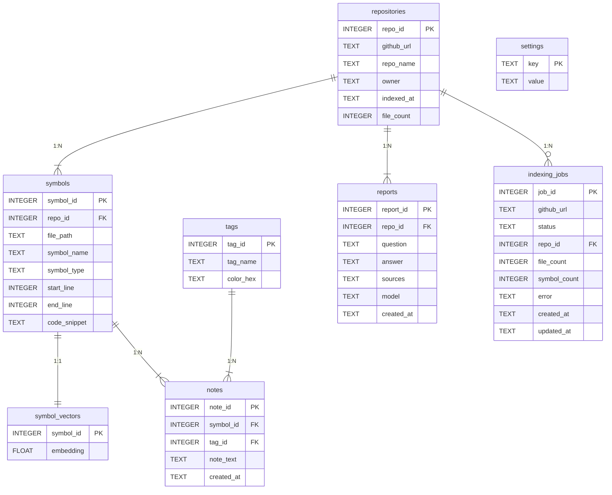

```mermaid
erDiagram
  repositories {
    INTEGER repo_id PK
    TEXT github_url
    TEXT repo_name
    TEXT owner
    TEXT indexed_at
    INTEGER file_count
  }
  symbols {
    INTEGER symbol_id PK
    INTEGER repo_id FK
    TEXT file_path
    TEXT symbol_name
    TEXT symbol_type
    INTEGER start_line
    INTEGER end_line
    TEXT code_snippet
  }
  symbol_vectors {
    INTEGER symbol_id PK
    FLOAT embedding
  }
  tags {
    INTEGER tag_id PK
    TEXT tag_name
    TEXT color_hex
  }
  notes {
    INTEGER note_id PK
    INTEGER symbol_id FK
    INTEGER tag_id FK
    TEXT note_text
    TEXT created_at
  }
  reports {
    INTEGER report_id PK
    INTEGER repo_id FK
    TEXT question
    TEXT answer
    TEXT sources
    TEXT model
    TEXT created_at
  }
  indexing_jobs {
    INTEGER job_id PK
    TEXT github_url
    TEXT status
    INTEGER repo_id FK
    INTEGER file_count
    INTEGER symbol_count
    TEXT error
    TEXT created_at
    TEXT updated_at
  }
  settings {
    TEXT key PK
    TEXT value
  }
  repositories ||--|{ symbols : "1:N"
  repositories ||--|{ reports : "1:N"
  repositories ||--o{ indexing_jobs : "1:N "
  symbols ||--|| symbol_vectors : "1:1"
  symbols ||--|{ notes : "1:N"
  tags ||--|{ notes : "1:N"
```